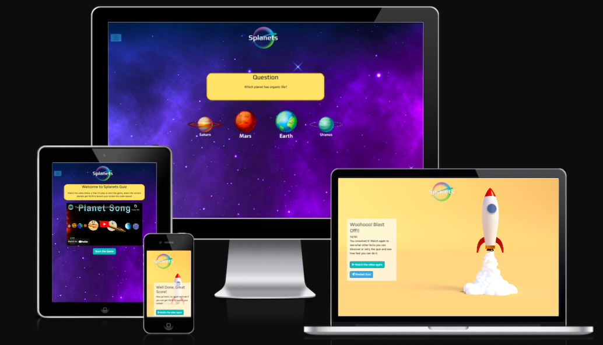

<h1 align="center">Splanets- Beta Test Site</h1>
<h1 align="center"></h1>

 Live website

 GitHub Repository

## About

The brief for this website is to provide a company with a beta test site to gauge the interaction and effectiveness of their children’s educational app idea before they progress with the app build. The idea driving the app build is to utilise educational videos and fun videos on YouTube that children may already be familiar with and test how much information the children actually retain. The team want to see if developing mini quizzes with a reward at the end would enhance memory retention and improve their understanding of the subject and encourage further learning.

The quiz to be built will be given the unique name of Splanets and will improve their understanding of the solar system when watching the following fun and educational video by KidsLearningTube; 

The Planet Song - 8 Planets of the Solar System Song for Kids

 The Planet Song - 8 Planets of the Solar System Song for Kids 

The target audience will be Children aged 6-12 years. The quiz format should reference the video and should then present the user with multiple choice questions and answers based purely on the information provided within the video. The emphasis from the brief is to keep the learning and testing of knowledge fun whilst challenging. 

## Table of Contents

[User Experience (UX)](#UX)

[Features](#features)

[Technologies Used](#technologies)

[Testing](#testing)

[Deployment](#deployment)

[Known Bugs](#bugs)

[Credits](#credits)

## User Experience (UX)

### User Stories - Children aged 6-12 years
- #### Children who find it hard to retain information delivered within written form.
    1. I want to be able to consume the information taught in a visual, fun and engaging manor.
    1. I want any quiz writing to be minimal.
    1. I want to be able to select the answers myself.
    1. I want a visual reward to work towards to keep me engaged. 
    
    
- #### Children who find it hard to hold their concentration in traditional educational environments.
    1. I am easily distracted, anything with too many words or instructions in it and i loose interest. 
    1. Anything that is hard to navigate will mean i loose interest, navigating the quiz must be intuitive. 
    1. I like to learn alone and so i must be able to select the answers myself. 
    1. I need education to be fun and engaging to maintain my concentration. 
    1. I struggle to sit with a book so something interactive is better suited to my learning style. 
   

- #### Children who want to learn more about a specific subject and enjoy self directed learning.
    1. I am fascinated by the topic of the solar system and love learning new facts about it. 
    1. I am enjoy learning independently so would like a simple quiz i could navigate on my own.
    1. I love to be tested and want to achieve a high score so it is important that i know my score and am rewarded for my hard work. 
    
### User Stories - Business Owner
- #### I am a business owner currently wishing to test the concept of an app that intends to help children enhance their memory retention and improve their understanding of certain subjects like the solar system when watching educational videos by using fun and engaging multiple question quizzes.
    1. I need the product to be fun and engaging to encourage repeat plays and encourage users to want more i.e. progress to the next level of learning. 
    1. I need the product to be simple enough for children of age 6-12 to utilise it. 
    1. I need it to be optimised for tablet screens as this is how it will mainly be tested.

### Design Choices

- #### Colour scheme
    - In order to fulfil the brief of making this quiz immersive, engaging and yet still accessible meant that the colours selected for use within the site had to work well against a darker solar system background. The colours chosen reflect those found within the planet vector images used for the buttons and galaxy image and are all colours that pop against the darker background. The colour for the background of the questions and instructions box reflects that of the sun and tie in to the score pages at the end. Keeping a consistent theme. The brighter elements of these colours were selected for the logo planet and then also used within the buttons at the start and the end of the quiz. White text colour has also been kept consistent across buttons, logo and answer images as this created the best contrast for readability. The initial larger colour spectrum was used to experiment with colours and narrowed down to the utilised second palette.

        

        

- #### Typography
    - The main brand identifiable font used is a Play - a unique google font that provide a space look and feel whilst still being very accessible and easily read by children. It has a space like quirk whilst still being slightly rounded which i feel is more appealing for children. The secondary font for titles and headings and Source San Pro as the main text font. Sans-serif has been chosen as a fall-back font. 
    I have chosen to mainly only style the headings as text is kept to a minimum. 
   

    - Play
       
        

    - Source Sans Pro

        

- #### Imagery
    - I have ensured that the site contains imagery that is bright and creates an immersive solar system feeling for the player. The background is that of the solar system filled with twinkling stars. The logo has been created to be part of the space theme and the vector images have purposefully been chosen for the answer buttons to appear as if they are floating in outer space. The imagery is also very clear and allows the child to readily identify the planets in relation to the images within the video. Ensuring the colours and styles of the video are carried through to the quiz helps to make it feel like one user experience. The try again page and rocket launch page have been kept consistent with each other and the background of this used for the question and instruction card linking all of the quiz elements together. 

- #### Wireframes
    - After roughly sketching an idea of the rough structure i inputed this into Balsamiq to create the following basic wireframes.

         

- #### Mockups
    - After selecting the brand colours and potential imagery i created a mock up of just the basic desktop to see if the imagery and colours sat well together. The combination of wireframe and mock-up really assisted in developing my decisions around navigation and functionality with one page display. It also helped to ensure the fun and immersive element to the design and changed my thought process from displaying a score at the end that would tell the user what planet they were to instead enabling the child to launch a rocket if they achieved 10/10 which i feel makes it more rewarding for all age groups.

        

## Features

### Existing Features

#### Common Features Across All Pages
- **Favicon** - 
    - a favicon of the planet logo but in the brand colours is visible on the site tab so that all users can    easily navigate back to the site with ease when multiple tabs are open.
- **Header** - Provide instant impression on the user but simple structure so as not to distract.
    - I opted to use a transparent navigation bar with a central logo that links back to the index page which is the video and option to start the quiz. 
    - The navigation has been left as a simple toggle on all screen sizes as i felt this created a simpler less distracting visual.
    - The toggler provides two links one to the home page with the video and the other to the start of the quiz so that the user can start again and see the instructions and video or skip to start the quiz automatically. 
    - The toggler has been removed from the retry and rocket launch pages as these provide clear buttons to navigate back to the video and start of quiz.
    - 
- **Accessibility**
    - The video at the start has had auto play taken off so that the user needs to start it. 
    - The rocket launch video has text to explain the animation is not supported in your browser if seen.
    - The hamburger menu has aria-label added to let users with screen readers know where the toggleable menu is.
- **Buttons**
    - The same hover transition and colours have been applied to the buttons across all pages in order to create a cohesive look and make the call to action clear and easy to find. The font is the same for all buttons. 
    - The answer image buttons are set to expand when hovered over and the cursor set to change to the hand pointer when able to select a button.
- **Responsiveness**
    - All Pages have been built around Bootstrap 5'S responsive grid layout and provide the same functionality regardless of the viewport size, Apart from the rocket launch page which does not show the same level of responsiveness in the smaller screen. This is a site designed mostly for use on a children's tablet. However this is something the client would need to bear in mind when designing the app. 
- **Footer**
    - There is no footer as this was felt to be unnecessary considering the one page nature of the site design.
    

### Specific to Pages
-  **Index**
    - Welcome card with instructions text
    - The featured video to be watched
    - Start Game button
-  **Quiz**
    - This contains the question card with the answer images below. When answered a notification pops up within the question card to notify if correct or incorrect and disappears.
    - at the end the text within the question card is replaced with the final score.
- **Try Again**
    - This page is automatically loaded after the a final score of 9 or less is shown. 
    - The page congratulates the child on their hard work and encourages them to retry or re watch and start again with the aim of launching a rocket when obtaining 10/10.
- **Rocket Launch page**
    -  This page automatically loads after a user achieves 10/10. The background animation shows a rocket blast off leaving the user in the clouds of its wake.
    - This card congratulates the child and then encourages them to go back re-watch and see what other facts they can find within the video, encouraging further learning.

### Features to be implemented to improve service
- A timed disable of the start button to ensure that users watch the full video before commencing the quiz. This would be coupled by a smaller link button underneath for those who have watched it and don't want to wait.
- The option to play the question in audio for younger children with more limited reading abilities and additional features that would assist to improve the access of the quiz and its answers to those with limited sight.
- A progress bar under the image answers to provide the player with a guide of how many questions left. I feel this would be an important addition especially for children who may loose attention if they feel something is hard.
- Change the incorrect and correct messaged and instead make it more visceral with an animated response of the planet shaking or a green tick or cross appearing over the chosen image. I feel this would provide a better learning experience for the child.
- A leader board to be implemented for those who score 10/10. This would be a leader board based on who completed the quiz the fastest and would only retain the top 5 speeds. I feel this would encourage children to keep trying the quiz once they had hit 10/10 and to keep coming back to revisit and reclaim their position on the leader board.

### Technologies Used

### Languages Used

- [HTML5](https://en.wikipedia.org/wiki/HTML5)
- [CSS3](https://en.wikipedia.org/wiki/Cascading_Style_Sheets)
- [JavaScript](https://www.javascript.com/)

### Frameworks, Libraries, Programs, Online Resources Used

- [Git](https://git-scm.com/) 
- [GitPod](https://www.gitpod.io/) 
- [Github](https://github.com/) 
- [Bootstrap v5](https://getbootstrap.com/) - Responsive Elements Hero, navigation, buttons & cards.
- [jquery](https://jquery.com/) - Used for the toggle function in the navigation
- [Google Fonts](https://fonts.google.com/) - Play and Source Sans Pro fonts
- [Font Awesome](https://fontawesome.com/) - Button icons.
- [Photoshop](https://www.adobe.com/ie/products/photoshop.html - images have been resized and edited within photoshop.
- [Coloors](https://coolors.co/) - Used to create the colour palettes and identify complimentary and contrasting colours. This was also used to check the accessibilty of the text colour with each background colour during the planning stage. 
- [RGBA Color Picker](https://rgbacolorpicker.com/hex-to-rgba) - to match hex colours to an RGBA so that i could change the apacity accurately.
- [Istock](https://www.istockphoto.com/)- Istock used for all imagery within the site. image credit as follows
     - [Galaxy Background](https://www.istockphoto.com/vector/space-background-with-realistic-nebula-and-shining-stars-colorful-cosmos-with-gm1173451503-325938376) image by Egor Suvorov from Istock
     - [Planet Vectors](https://www.istockphoto.com/vector/glossy-planets-vector-set-gm453780213-30624312) Vector image by andegro4ka from Istock
     - [Rocket Animation](https://www.istockphoto.com/video/ship-rocket-launch-startup-new-business-project-new-business-project-concept-vehicle-gm1249549420-364189430) created by Zozulinskyi from Istock
- [youtube](https://www.youtube.com/watch?v=mQrlgH97v94) The Planet Song - 8 Planets of the Solar System Song for Kids | KidsLearningTube on Youtube 
- [Fiver](https://www.fiverr.com/gemmawilson?source=inbox) Logo png files and favicon created by Gemma Wilson
- [Figma](https://www.figma.com/file/ladBUkKqWA50bv0xDRaMUH/SPLANETS?node-id=0%3A1&t=rRbFBuY40vnsdoR4-1) used to create mock up designs
- [Balsamiq](https://balsamiq.com/wireframes/desktop/) Used to create the initial wireframes
- [amiresponsive](https://ui.dev/amiresponsive) Used to create the live image capture of site

## Testing

 ### Functionality Testing
- Navbar - visible on all viewports collapsing down into a toggle hamburger at the correct breakpoint. Navbar transparent remains and the background colour appears to make the toggle menu readable. All links clickable and take you to the correct pages. Logo takes you to the home page. All hover transitions working.
- All cards resize correctly keeping the text and images clear and readable.
- All internal links connected to the buttons tested. 
- All media functioning on site. YouTube not auto playing and not skipping to next video. Background animation playing automatically on mute. 
- All questions and answers loading
- The right answers being recorded as correct and incorrect
- The incorrect and correct alerts displaying and clearing
- The end score displaying and directing to retry page for 9/10 or less and to the rocket launch for 10/10 scores.

### CSS3 validator - Pass

http://jigsaw.w3.org/css-validator/validator$link

### HTML5 validator
- Index - Document checking completed. No errors or warnings to show.
- Game - Document checking completed. No errors or warnings to show. The image src="" had to be updated to 0 for the checker to accept.
- Tryagain - Document checking completed. No errors or warnings to show.
- Rocketlaunch - Document checking completed. No errors or warnings to show.

### Javascript validator
- https://jshint.com/ used the test has shown the following data;
- Metrics
  There are 5 functions in this file.
  Function with the largest signature take 0 arguments, while the median is 0.
  Largest function has 13 statements in it, while the median is 1.
  The most complex function has a cyclomatic complexity value of 5 while the median is 1.
  One warning
  * 150	Functions declared within loops referencing an outer scoped variable may lead to confusing semantics. (i, question, result, spQuiz, newQuestion, score, displayQuestion)
  * One unused variable
  136	answer

### Lighthouse testing
- 
- further work and research required to improve the best practices
- 

### External testing
- All testers confirmed that all buttons and navigation links performed the correct function.
- The testers provided feedback on being able to click the buttons area not just on the circular planet. This is due to the images being square png files with a transparent background.
- Testers on tablets and mobiles identified that the background image was not extending or stretching down responsively with the change in button layouts. This caused issues in the fact that the white writing under the planets disappeared against the white background.
- During the testing process it was discovered that the animation was not fully visible to it maximum effect on smaller devices.

### Compatibility Testing
- Browser Compatibility tested via [Browser Stack](https://live.browserstack.com/) 
- tested on the latest versions of the following
    | Safari    | Firefox   | Chrome  | Opera  | Edge  |
    | --------- |:---------:| -------:| ------:| -----:|
    | Pass      | Pass      | Pass    | Pass   | Pass  | 
    
- Chrome developer tools has been used to check the responsiveness of the site across different screen sizes and devices. 
- The site has mostly been built and tested on a Macbook Air operating on MacOs Catalina.

### Performance Testing
-  The performance of the site was tested on the following site with satisfactory results. [Web Page Test](https://www.webpagetest.org)

### Testing User Stories 
### User Stories - Customer
- The initial wire frame suggested that that the test would watch the video and navigate through the quiz to be assigned a planet related to their score. "You are Venus get 2 more right to reach the sun" with climbing the ranks from furthest away from the sun to full marks meaning you made it to the sun. reviewing the age range and the user stories it was clear that this was too complex and convoluted an end goal and also not very fun for them. Fun and engaging is key to hold attention therefore we implemented the rocket launch animation at 10/10 and would make leader boards be around the speed of completing the quiz at full marks in order to encourage repeat play, hold their attention and improve their knowledge.
The imagery used is fun, engaging and immersive. It is important to note caution for accessibility of text due to the imagery and colours and additional features need to be simple and checked for appropriate contrast levels. Writing and instructions have been kept to a bare minimum without compromising the information delivered to make sure children can play independently.
The answer options have been limited to 4 per question despite 8 planets being available in order to not over whlem the child with options but also to provide a cleaner more minimal page which will enhance the user experience for children. The answer options have been created and styled to be in the most instantly identifiable form allowing children to play independently of all levels of ability. Even if a parent has to read the question the child will feel a sense of control and independence being able to confidently make the selections on their own. This should again increase engagment, hold attention and hopefully as a result increase their knowledge.
Navigation is simple and consistent mostly being controlled from the centre panel by the child but additional links provided to get back to the quiz or video.

### User Stories - Business Owner
- This Beta product fulfills the brief of playing the educational video about our solar system. The quiz is then presented to children in a fun and engaging manner with a simple enough layout and design that children within the age bracket 6-8 are able to play independently. 
- I have tested the quiz on 8, 10 and 12 year olds and all wanted to play again to see if they could improve their score and see the rocket launch. The second and thirds plays vastly improved their score meaning the retention of information was increasing. I noted that playing also encouraged them to share other facts about the solar system that they already knew. I feel this shows that the format created works to fulfill the clients brief. 

## Deployment

### Publishing
This website was published using [GitHub Pages](https://pages.github.com/). The procedure is outlined below.
1. Go to the GitHub website and log in.
2. On the left-hand side, you'll see all your repositories, select the appropriate one. ([Repository](https://github.com/PhilEllis/Splanets) used for this project).
3. Under the name of your chosen Repository you will see a ribbon of selections, click on 'Settings' located on the right hand side.
4. Scroll down till you see 'Pages' option on the left hand side.
5. Under "Source" click “deploy from branch” change the "None" dropdown under branch to "main" keep selected folder to “root”
6. Click "Save"
7. The page will reload and you'll see the link of your published page displayed under 'GitHub' pages.
8. It takes a few minutes for the site to be published, wait until the background of your link changes to a green color before trying to open it.

### Forking
If you wish to contribute to this website you can Fork it without affecting the main branch by following the procedure outlined below.
1. Go to the GitHub website and log in.
2. Locate the [Repository](https://github.com/PhilEllis/Splanets) used for this project.
3. On the right-hand side of the Repository name, you'll see the 'Fork' button. It's located next to the 'Star' and 'Watch' buttons.
4. This will create a copy in your personal repository.
5. Once you're finished making changes you can locate the 'New Pull Request' button just above the file listing in the original repository.

### Cloning 
If you wish to clone or download this repository to your local device you can follow the procedure outlined below.
1. Go to the GitHub website and log in.
2. Locate the [Repository](https://github.com/PhilEllis/Splanets) used for this project.
3. Under the Repository name locate 'Clone or Download' button in green.
4. To clone the repository using HTTPS click the link under "Clone with HTTPS".
5. Open your Terminal and go to a directory where you want the cloned directory to be copied in.
6. Type `Git Clone` and paste the URL you copied from the GitHub.
7. To create your local clone press `Enter`

## Known Bugs

There are no identified bugs at present. I am not fully happy with the solution to the background image not stretching the background as i feel there must be a better was of adapting other than setting the vh to the current setting. I utilised every potential varient i could think of so this is something i would look to refine before passing this to a client. I would also potentially add a media query implimenting a cut down video for mobile views so that the rocket can be fully appreciated. I however do not posess the video editing skills to make this happen.

## Bugs & challenges experienced during the build

- The Initial challenge with the JavaScript code during this build was building the question in the correct manner so that the correct 4 images would appear below the quiz and operate as the buttons. This required me to play about with the initial format of the question and answer.
- I initially opted to use the appendChild approach to place the four linked image answers under the question. This appeared to work despite the images not loading. After resolving the relative file paths the images loaded and were clickable.
- The next issue came as you progressed through the quiz the answer images did not clear. This left the user with 10 sets of 4 image options by the end of the quiz. To tackle this I, after discussing it with a tutor changed the empty div to 4 img elements. Assigned them with their answer id's and used document.getElementById to target the answer to each img, defined answerImages and added the setAttribute to the displayQuestion function.
- In doing the last step the eventListener had been deleted and so the quiz became unresponsive. I added the eventListener within the results if statement, tracking the correct and incorrect answers. The alerts displayed automatically via the javascript alert which needed to be dismissed. Once a score could be calculated i directed 9/10 or less than scores to an html document that would display try again and for scores of 10/10 the user is directed to an html document that will display the animation. The automatic alerts feature was removed as it did not facilitate a good user experience. I added in a correct and incorrect message to the innerHtml of the question card which showed under the next question being asked. This was confusing for the user as the message stayed under the question, so i added a setTimeout function and limited the correct/incorrect message visibility to 1s. I set another setTimeout function once the scores were calculated so that the user had time to see and digest their score before being redirected to the next page. 
- During the changes to the functions the answers started to all display as incorrect. Using line breaks within the developers console i discovered the null results showed when images were clicked leading me to implementing parseInt within the function in order to extract a number from the answers string.

## Credits

### Code 

- The majority of the code originated from the Bootstrap library and was styled with custom css.
- I reffered alot to W3School JavaScript tutorials https://www.w3schools.com/js/default.asp to help better understand and construct my JS.
- I watched a lot of quiz tutorials in order to better understand the process including the following;
https://www.youtube.com/watch?v=MxrGPP4F8Sc
https://www.youtube.com/watch?v=f4fB9Xg2JEY
- The only similar quiz i could find to the one i wanted to create was this which served as inspiration;
https://www.sanwebcorner.com/2021/04/picture-quiz-using-javascript.html
- I used stack overflow to search for similar problems and looked through the answers and possible solutions to help suggest where i was going wrong. 
- I posted in slack regarding the error in question not being defined and user Bob Bobton pointed out that i had only defined it for one function. Defining globally and outside of the function would help to solve the issue which it did.
- The following code was suggested by Slack user AR Riyad to assist with making the logo responsive on the rocket launch page
.fullscreen-video {
    z-index: -1;
}

.rocket-overlay {
    z-index: -2;
}

.logo .rocket-logo {
    z-index: 1;
}
- All of the rest of the code was written by the author - Philippa Ellis

### ReadMe Resources
- [Markdown Cheatsheet](https://github.com/adam-p/markdown-here/wiki/Markdown-Cheatsheet#code)
- Code Institute [SampleREADME](https://github.com/Code-Institute-Solutions/SampleREADME)
- Slacks numerous Markdown questions and answers
